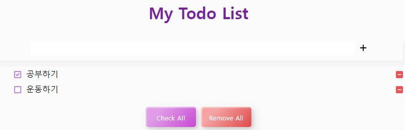

# Vue Todo App Project

### 기술 스택

- JavaScript
- Vue

### 개요

- 할 일을 작성, 체크, 삭제 할 수 있는 SPA(single page application) todo-app
- 상단의 흰 박스에 할 일을 작성하면 리스트에 추가된다.
- 오른쪽 체크박스를 누르면 할 일이 완료되었다고 체크할 수 있다.
- 왼쪽 박스를 누르면 리스트에서 할 일이 삭제된다.
- Check All 버튼을 누르면 모든 할 일이 완료되고, 한 번 더 누르면 모든 일의 체크가 풀린다.
- Remove All 버튼을 누르면 모든 할 일이 리스트에서 삭제된다.

### 후기

- Vue CLI를 이용해 여러 컴포넌트를 만들고, Vuex도 이용해볼 수 있는 프로젝트였다. Local Storage를 이용해 페이지를 새로고침해도 목록이 유지될 수 있게 했으며 파비콘도 이용해보았다.
- Vuex가 정말 편리하다고 느낀 프로젝트였다. 데이터를 한 곳에서 처리하도록 로직을 만드니 일일이 props, emit을 주지 않아도 되어 코드도 간결해졌다. 
- Vue 문법이나 사용법은 좀 더 익혀야하지만 프로젝트를 통해 더 잘 이해하고 사용할 수 있게 되었다. 
